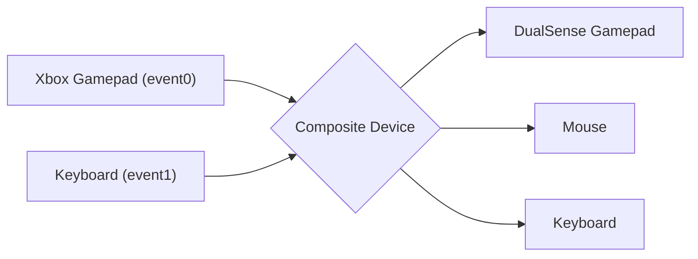
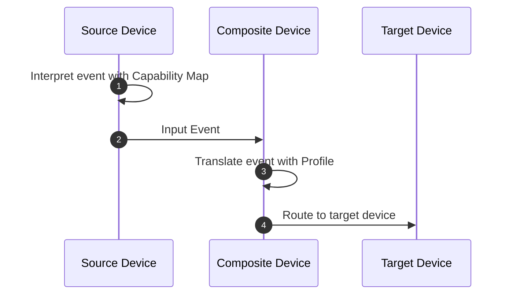

<h1 align="center">
  
   
  InputPlumber
</h1>

  
  
  
   

# About

InputPlumber is an open source input routing and control daemon for Linux. It can
be used to combine any number of input devices (like gamepads, mice, and keyboards)
and translate their input to a variety of virtual device formats.

## Features

* [x] Combine multiple input devices
* [x] Emulate mouse, keyboard, and gamepad inputs
* [x] Intercept and route input over DBus for overlay interface control
* [x] Input mapping profiles to translate source input into the desired target input
* [ ] Route input over the network

## How it works

InputPlumber is designed around the concept of a **Composite Device**, which
is a logical collection of one or more **_source devices_** that InputPlumber
reads input events from, then translates and routes those events to one or more
**_target devices_**.

### Input Event Flow

When InputPlumber reads an event from  a **source device**, it first identifies any
input events that may need to be interpreted differently using a **Capability Map**,
which is a YAML configuration file that tells InputPlumber how it should interpret
events from a source device. After the event is interpreted, it is sent to the
**Composite Device**.

Once the **Composite Device** receives the input event from the **source device**,
the event is translated according to any **Profile** that might be loaded on
the **Composite Device**. A **Profile** allows translating one kind of input
(like a gamepad joystick) into another kind of input (like mouse motion).

Finally, once the event is translated according to the **Profile**, it is routed
to any **target device(s)** that support the input event.

